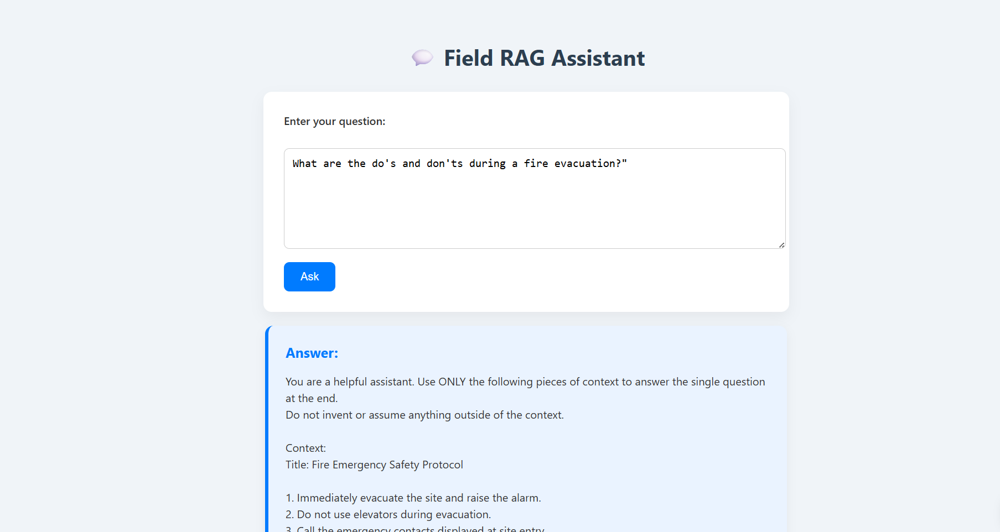

# 🤖 FIELD RAG ASSISTANT

**FIELD RAG Assistant** is an intelligent, context-aware question-answering assistant built using **Retrieval-Augmented Generation (RAG)**. It allows users to upload field-specific text data and ask natural language questions. The assistant retrieves the most relevant chunks of the uploaded content and generates precise answers using an LLM (Large Language Model).

---

## 🌟 Features

- 🔍 **Contextual Question Answering**  
  Asks questions based on custom field-related text files (e.g., manuals, policies, notes).

- ⚙️ **Retrieval-Augmented Generation**  
  Combines semantic search (using vector embeddings) with language generation to improve accuracy.

- ⚡ **Efficient Local Inference**  
  Runs on your **local machine** with minimal configuration.

- 🧠 **Powerful Open-Source LLM**  
  Utilizes Hugging Face's `zephyr-7b-beta` for generating intelligent and context-aware responses.

---

## 🎥 Demo

## 🖼️ Demo Images

### 🔍 Home Page Screenshot


### ✅ Response Example


## 🛠️ Technologies Used

| Technology | Description |
|------------|-------------|
| **Python** | Core language used for building backend logic and data processing |
| **LangChain** | Framework for chaining together LLMs and vector stores (used for RetrievalQA) |
| **Hugging Face Transformers** | Provides access to pre-trained open-source models such as Zephyr |
| **FAISS** | Fast similarity search library used for storing and retrieving text embeddings |
| **sentence-transformers** | Converts text into high-quality vector embeddings for semantic search |
| **.env (Environment Variables)** | Used to securely store the Hugging Face API key |

---

## 📁 Project Structure
```field-rag-assistant/
│
├── data/               # Folder containing your custom .txt documents
├── app.py              # Entry point for running the app
├── rag_pipeline.py     # Core logic: loading data, embedding, retrieval, and QA chain
├── requirements.txt    # Python dependencies
└── README.md           # This file
```

## 🚀 How to Use Locally

1.  **First, apply your own API key**
    In your Python file (e.g., `app.py`), add or update the following line with your actual API token:

    ```python
    os.environ["HUGGINGFACEHUB_API_TOKEN"] = "your_api_token"
    ```

2.  **Run the application**
    Open your terminal or command prompt, navigate to the directory where your `app.py` file is located, and run the following command:

    ```bash
    python app.py
    ```

3.  **Access the application**
    The application will start running on a local server, typically accessible at:

    ```
    [http://127.0.0.1:5000](http://127.0.0.1:5000)
    ```
    Open this URL in your web browser.

4.  **Exit the application**
    To stop the server and exit the application, press `Ctrl + C` in your terminal.

🔐 Important Notes
This application uses your local machine, so no data is sent to external servers beyond the Hugging Face model call.

## 🛡️ Security Note

**Never commit your API token in `.env` or code files.**

GitHub will automatically block pushes containing secrets.


Feel free to contribute, raise issues, or fork the repo! enthusiast

## 🔮 Future Improvements

- 🌐 Web interface using **Streamlit** or **Flask**
- 📄 Support for loading **PDF** and **DOCX** documents
- 📊 **Logs and analytics** for answered questions
- 🧭 Integration with **browser extensions** or **APIs**

## 👤 Author

**Manan Goyal**  
🔗 [GitHub](https://github.com/MananRRK)  
📧 mananmlzs@gmail.com  
📞 +91-7895296561


